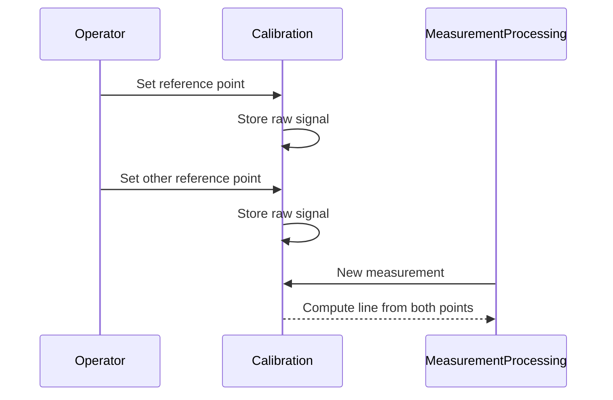
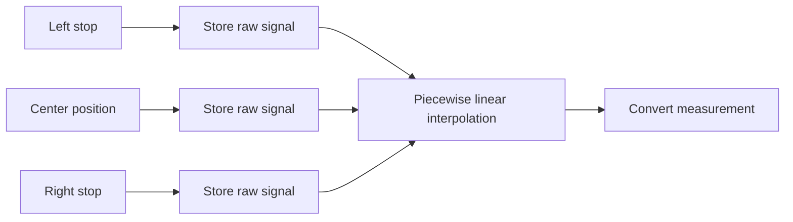

# Calibration Methods: Two-Point and Multi-Point Calibration

## Why calibrate at all?

No sensor delivers exactly the physical value you actually want to measure straight out of the box. A raw signal (for example a voltage, a current, or a digitized number 0…4095 from an analog-to-digital converter) is only indirectly related to the desired physical quantity - the steering angle, the fill level, or the oil pressure, say. Two sources of error practically always show up together:

- a **zero-point error** (offset): the raw signal is not itself zero at the true physical zero, but shifted by a constant amount, and
- a **slope error** (gain or span error): a change in the physical quantity does not produce exactly the expected change in the raw signal, but one that deviates from it, more or less.

Calibrating means: at at least two known, physically reached reference points (for example "full lock left" and "full lock right"), relate the raw signal measured there to the physical target value that actually applies at that point - so that a conversion rule for all values in between falls out of it.

## The classic method: zero point, then slope

The traditional approach, inherited from instrumentation engineering, corresponds exactly to setting up a line equation `y = m·x + b` from school math - only carried out as two separate, sequential physical actions:

1. **Zero-point adjustment:** Move to the lower reference (for example the left-hand stop), enter the desired target value, and trigger the zero-point trim. Internally this computes an offset `b`, so that the reading is correct at exactly this one point.
2. **Slope adjustment:** Move to the upper reference (for example the right-hand stop), enter the second target value, and trigger the span trim. This computes the slope `m` - using the offset already determined in the first step.

The method works, but it has a built-in trap: the second step **strictly requires** the first step to have already been carried out, because the slope calculation continues to work with the intermediate result remembered during the zero-point adjustment. If, by mistake, the span is adjusted first with no zero point ever set (or the order is swapped), the system computes using a value that has not yet been meaningfully set - often a technical default or a leftover from a previous calibration - and the result is a silently wrong calibration that looks plausible at first glance. In practice this is guarded against technically: the span adjustment simply cannot be triggered until the zero point has been set at least once. That reliably protects against the operating mistake, but it costs extra effort - a sequencing safeguard that is only needed in the first place because the calculation method itself forces an order.

## The smarter method: independent reference points

The more modern approach solves exactly this problem by separating the calculation step from the calibration action:

- When a reference position is reached, **only** the raw signal measured there is stored, unchanged - a pure snapshot operation, with no calculation and no reference to any other calibration point.
- The actual conversion (the line through the stored points) is **not** computed during calibration, but freshly, every single time a new measurement actually needs to be displayed or processed further.

This removes the dependency on a particular order between the two calibration steps: each step on its own only records an independent number, so the reference points can be set in any order, repeated as often as needed, and - particularly relevant in practice - recalibrated individually, for example when only one of the two end stops needs readjusting in the field, without the other one having to be redone. Order-independence is not the same thing as completeness, though: the conversion itself is of course only available once both required reference points have actually been set - before that, the line is simply still missing its second support point. The difference from the classic method is not that a point may be missing, but that it no longer matters *which* of the two is set first.

The principle extends directly to three (or more) reference points. Whenever a sensor has a distinguished center position in addition to its two end stops - the classic case being a steering angle sensor with the three references "full lock left", "straight ahead", and "full lock right" - a single line equation is no longer enough, because mechanical tolerances can make the characteristic curve run at a different slope to the left of center than to the right. Each of the three points then independently stores its own measured raw value, and the points are afterwards connected piecewise-linearly - one slope between the left stop and center, a separate, independent slope between center and the right stop. Here too, the same rule holds unchanged: because each of the three points only independently stores a raw value, and the interpolation only happens at read-time, there is no enforceable order between the three calibration steps at all - each point can be set on its own, and readjusted later on its own. And once again the same caveat applies: as long as not all three points have actually been set, the conversion is missing one of its support points - freedom of order does not remove the need to eventually have visited every required point.

## The general lesson behind it

The difference between the two methods is not, in the end, a special case unique to sensor calibration - it is a general design principle that remains valid far beyond it: whenever several independent pieces of information need to be captured, it is worth asking whether they must be folded into a running intermediate result immediately as they are captured - or whether it would be simpler and more robust to first store each piece of information on its own, unchanged, and only compute the actual result later, on demand, from all the individual values taken together.

The first variant saves a little computation at the moment of capture itself, but pays for it with a hidden ordering dependency between the capture steps - with all the consequences that has for operation, error safety, and maintainability: an extra sequencing check becomes necessary, a single step can no longer be repeated on its own without risk, and the actual reason for the required order is often not visible from the outside at all, only understandable from the internal calculation rule. The second variant is marginally more work at the moment of capture itself - the raw value simply has to be kept separately instead of being folded in right away - but gains robustness in return: every capture step is, on its own, completely independent, repeatable as often as needed, and executable in any order, because it needs no knowledge of the other steps at all.

This trade-off - "fold it in immediately and accept a dependency" versus "just record it for now, and dissolve the dependency by pushing it to the end" - comes up again and again in control and measurement engineering, far beyond the calibration of individual sensors. It is worth deliberately checking, for every multi-step capture or setup procedure, which of the two variants is actually at play - and whether an apparently "logical" order is really justified by the underlying problem, or merely a side effect of how the calculation happened to be built.

## Implementations in Function Block Libraries

The calibration procedures described above are available as ready-to-use function blocks in the **4diac Library Reference** and the **OSCAT Basic Library**:

### Two-Point Calibration (Offset & Scale)

- [CALIBRATE (4diac Library Reference)](https://meisterschulen-am-ostbahnhof-munchen-docs.readthedocs.io/projects/4diac-library-reference-docs/en/latest/Bibliotheken/ExternalLibraries/OSCAT/Basic/POUs/Engineering/measurements/CALIBRATE/): Classic Boolean-triggered two-point calibration (`Y = (X + OFFSET) * SCALE`).
- [E_CALIBRATE (4diac Library Reference)](https://meisterschulen-am-ostbahnhof-munchen-docs.readthedocs.io/projects/4diac-library-reference-docs/en/latest/Bibliotheken/ExternalLibraries/OSCAT/Basic/POUs/Engineering/measurements/E_CALIBRATE/): Event-driven two-point calibration (`EICO`/`EICS`).
- [AR_CALIBRATE (4diac Library Reference)](https://meisterschulen-am-ostbahnhof-munchen-docs.readthedocs.io/projects/4diac-library-reference-docs/en/latest/Bibliotheken/ExternalLibraries/adapter/Engineering/measurements/AR_CALIBRATE/): Adapter-based two-point calibration for IEC 61499.

### Three-Point Calibration (Min, Mid, Max)

- [CALIBRATE_3P (4diac Library Reference)](https://meisterschulen-am-ostbahnhof-munchen-docs.readthedocs.io/projects/4diac-library-reference-docs/en/latest/Bibliotheken/ExternalLibraries/OSCAT/Basic/POUs/Engineering/measurements/CALIBRATE_3P/): Boolean-triggered three-point calibration with center-offset compensation (e.g. joysticks).
- [E_CALIBRATE_3P (4diac Library Reference)](https://meisterschulen-am-ostbahnhof-munchen-docs.readthedocs.io/projects/4diac-library-reference-docs/en/latest/Bibliotheken/ExternalLibraries/OSCAT/Basic/POUs/Engineering/measurements/E_CALIBRATE_3P/): Event-driven three-point calibration (`EI_MIN`/`EI_MID`/`EI_MAX`).
- [AR_CALIBRATE_3P (4diac Library Reference)](https://meisterschulen-am-ostbahnhof-munchen-docs.readthedocs.io/projects/4diac-library-reference-docs/en/latest/Bibliotheken/ExternalLibraries/adapter/Engineering/measurements/AR_CALIBRATE_3P/): Adapter-based three-point calibration for IEC 61499.

### OSCAT Documentation (Structured Text)

- [CALIBRATE (OSCAT Basic Docs)](https://oscat.readthedocs.io/projects/oscat-basic/de/latest/Engineering/measurements/calibrate/): Documentation of the original OSCAT ST implementation.

